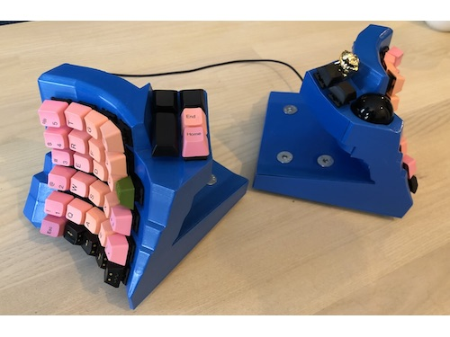
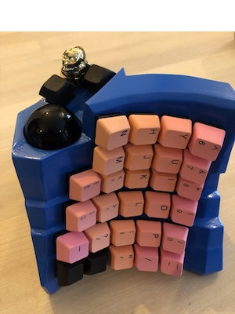

# Dactyl TypeSafe
Inspired by the [SafeType](https://safetype.com/index.php) and [dactyl](https://github.com/adereth/dactyl-keyboard) keyboards.

## Parts list
1. [nylon 8mm ball transfer units](https://www.aliexpress.com/item/32839736943.html) * 3 for the trackball.
2. [non-slip mat](https://www.amazon.com/ROOS-Self-Stick-Anti-Skid-Furniture-Protectors/dp/B01K7JFXAA)
3. 34mm ball
    - The heavier the better I think
3. [adns 9800 laser sensor board](https://www.tindie.com/products/jkicklighter/adns-9800-laser-motion-sensor/)
4. Nuts and bolts
    - 16 * countersunk M3 nuts/bolts for holding the case together
    - 4 * countersunk M8 nuts/bolts and 8 or so 60mm washers for adding weight (see the stl for the bottom pieces for where these go)
    - 2 * M2 bolts and 6 * M2 nuts for the laser sensor, 10mm
5. [4 pole audio sockets](https://www.aliexpress.com/item/4000105730426.html) * 2
6. [micro usb cable](https://www.amazon.com/UGREEN-Adapter-Samsung-Controller-Android/dp/B00N9S9Z0G) with the casing around the female end removed.
7. All the other stuff to wire a keyboard. I built mine around a teensy 3.5 and an mcp 23017. See [my parts list](teensy3#parts-list)

## Assembly notes
- For the nuts/bolts that hold the case together.
    1. Put the nut in the little slot and screw in the bolt.
    2. Fill in the slot with hot glue and let it dry.
    3. Unscrew the bolt.
