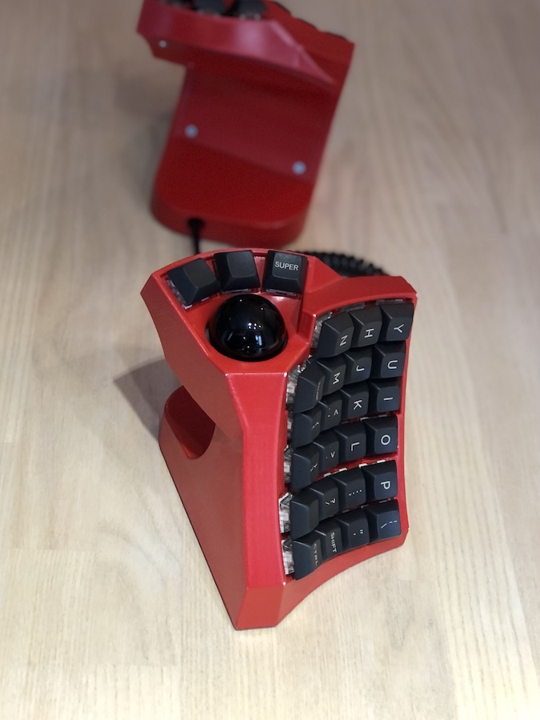
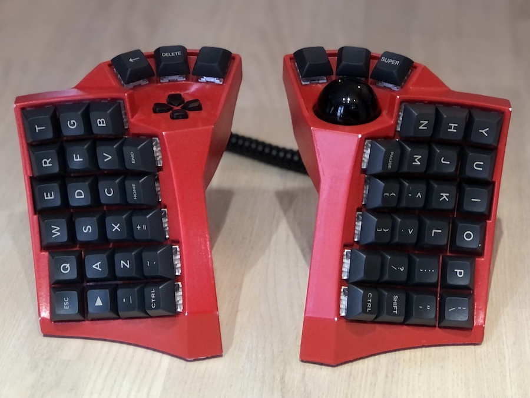
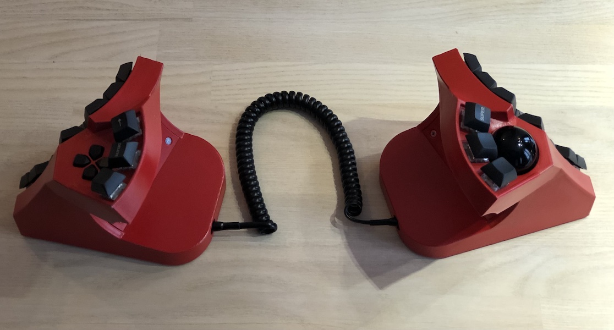
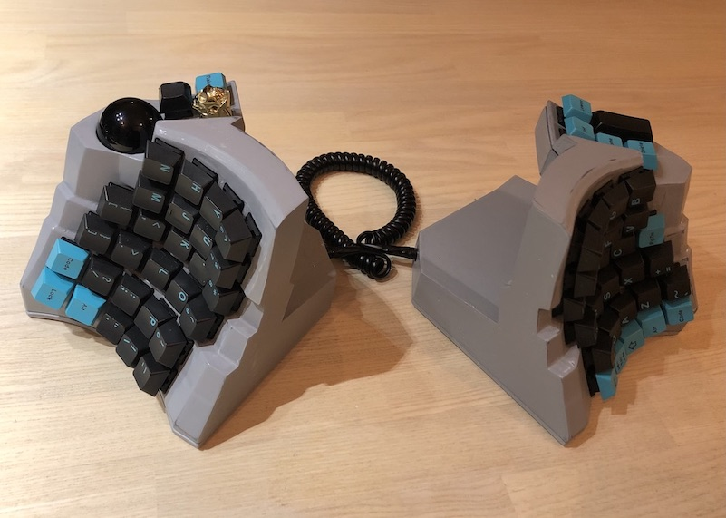

# Dactyl TypeSafe
Inspired by the [SafeType](https://safetype.com/index.php) and [dactyl](https://github.com/adereth/dactyl-keyboard) keyboards.

## Parts list
### both 5x6 and 4x6
1. [nylon 8mm ball transfer units](https://www.aliexpress.com/item/32839736943.html) * 3 for the trackball.
2. [non-slip mat](https://www.amazon.com/ROOS-Self-Stick-Anti-Skid-Furniture-Protectors/dp/B01K7JFXAA)
3. 34mm ball
    - Any 34mm ball will probably work, but I think it's best to use [a replacement trackball](https://www.aliexpress.com/item/4000351102541.html). You will get better response and precision.
3. [adns 9800 laser sensor board](https://www.tindie.com/products/jkicklighter/adns-9800-laser-motion-sensor/)
4. [4 pole audio sockets](https://www.aliexpress.com/item/4000105730426.html) * 2
5. [micro usb cable](https://www.amazon.com/UGREEN-Adapter-Samsung-Controller-Android/dp/B00N9S9Z0G) with the casing around the female end removed.
6. All the other stuff to wire a keyboard. I built mine around a teensy 3.5 and an mcp 23017. See [my parts list](teensy3#parts-list)

### 5x6 parts
1. Nuts and bolts
    - 16 * countersunk M3 nuts/bolts for holding the case together
    - 4 * countersunk M8 nuts/bolts and 8 or so 60mm washers for [adding weight](things/5x6/weight.jpeg)
    - 2 * M2 bolts and 6 * M2 nuts for the laser sensor, 10mm

### 4x6 parts
1. Nuts and bolts
    - 14 * countersunk M3 nuts/bolts for holding the case together
    - 3 * M3 nuts/bolts for holding the d-pad in place
    - 4 * countersunk M8 nuts/bolts and 8 or so 60mm washers for [adding weight](things/5x6/weight.jpeg)
2. An old controller with a d-pad in it. I used an old dualshock that I picked up at a second hand store for like $3.
3. [D-pad buttons for a dualshock 4](https://www.aliexpress.com/item/32952683815.html)

## Assembly notes
- For the nuts/bolts that hold the case together.
    1. Put the nut in the little slot and screw in the bolt.
    2. Fill in the slot with hot glue and let it dry.
    3. Unscrew the bolt.
### 4x6 notes
- the d-pad
    - I chopped up an old dualshock controller and used [this method](https://learn.adafruit.com/super-game-pi/prep-button-pcbs).
    - I think you could also use regular [tact switches](https://www.aliexpress.com/item/1058764733.html) (I plan on trying this out as well).
- I just used some wire/solder to hold the laser sensor in place.
- You should be able heat insert the 3 M3 nuts into the top of the platform for the d-pad with a soldering iron.
