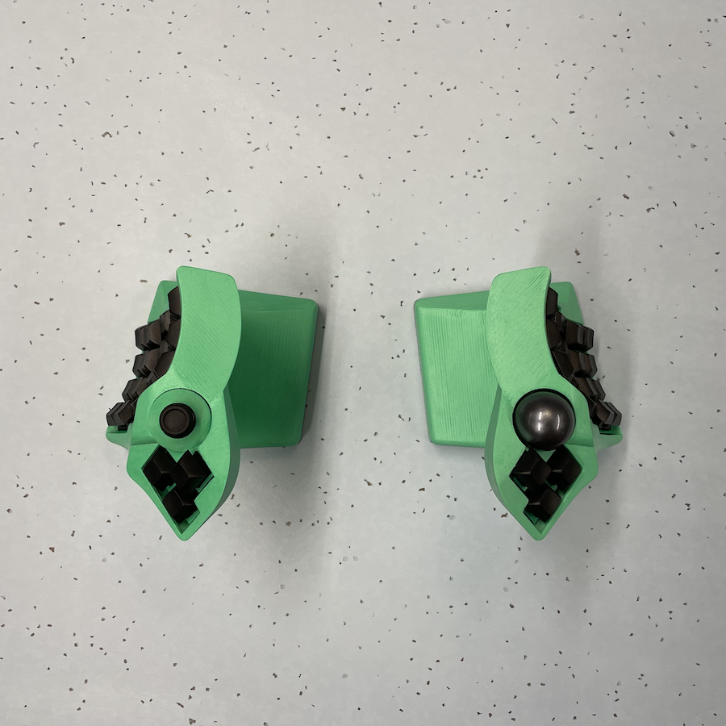

# Dactyl TypeSafe
A vertical split keyboard inspired by the [SafeType](https://safetype.com/index.php) and [dactyl](https://github.com/adereth/dactyl-keyboard).

## Parts list
1. [nylon 8mm ball transfer units](https://www.aliexpress.com/item/32839736943.html) * 3 for the trackball.
1. [non-slip mat](https://www.amazon.com/ROOS-Self-Stick-Anti-Skid-Furniture-Protectors/dp/B01K7JFXAA)
1. 34mm ball
    - Any 34mm ball will probably work, but I think it's best to use [a replacement trackball](https://www.aliexpress.com/item/4000351102541.html). You will get better response and precision.
1. [adns 9800 laser sensor board](https://www.tindie.com/products/jkicklighter/adns-9800-laser-motion-sensor/)
1. 2 * [nice!nano](https://nicekeyboards.com/nice-nano/) boards.
1. [D-pad buttons for a dualshock 4](https://www.aliexpress.com/item/32952683815.html)
1. 4 * [tact switches](https://www.aliexpress.com/item/1058764733.html)
1. M3 [heat set inserts](https://www.aliexpress.com/item/2255800878462496.html) and countersunk bolts
1. M2 nuts/bolts for the laser sensor
1. [jst connectors](https://www.aliexpress.com/item/2255800221261384.html) for everything (see [wiring](things/4x6-wireless/wiring.jpg))
1. A bunch of 95mm width metal plates (see [weights](things/4x6-wireless/weights.jpg))
1. Some batteries (I used some AA shaped ones so I can remove them)

If you're looking for the old wired design, see [v1](https://github.com/tewtham/dactyl-typesafe/releases/tag/1.0.0).