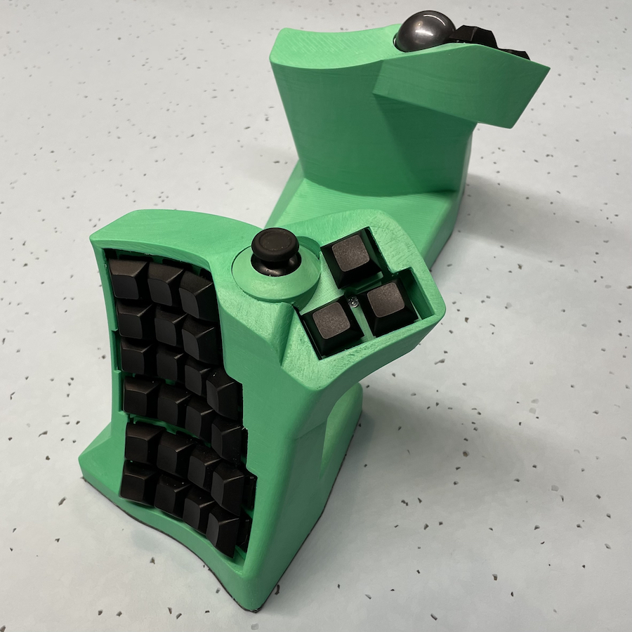
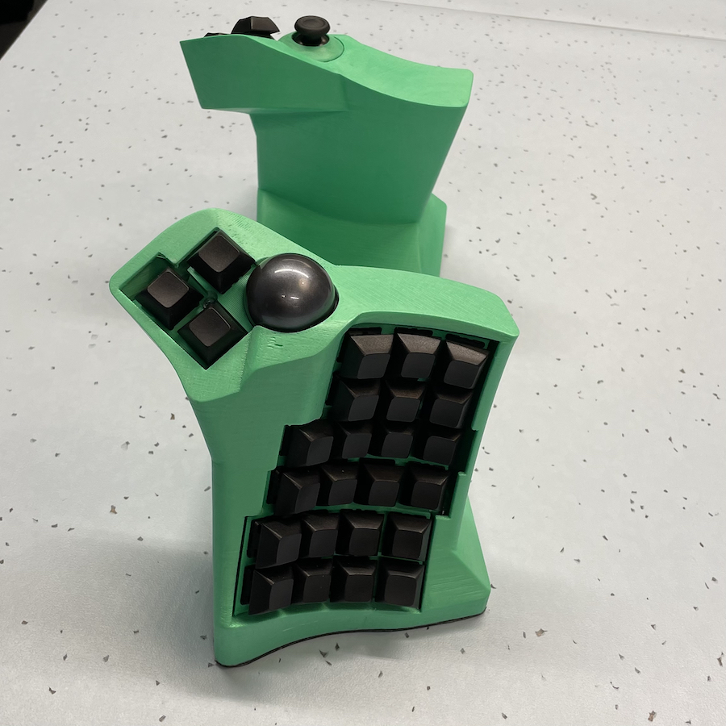

# Dactyl TypeSafe
A vertical split keyboard inspired by the [SafeType](https://www.amazon.com/SafeType-Keyboard-Black-Color-V902/dp/B0049PFYWQ) and [dactyl](https://github.com/adereth/dactyl-keyboard).

## Parts list
1. [nylon 8mm ball transfer units](https://www.aliexpress.com/item/32839736943.html) * 3 for the trackball.
1. [non-slip mat](https://www.amazon.com/ROOS-Self-Stick-Anti-Skid-Furniture-Protectors/dp/B01K7JFXAA)
1. 34mm ball
    - Any 34mm ball will probably work, but I think it's best to use [a replacement trackball](https://www.aliexpress.com/item/4000351102541.html). You will get better response and precision.
1. [pmw3360 laser sensor board](https://www.tindie.com/products/jkicklighter/pmw3360-motion-sensor/)
1. 2 * [nice!nano](https://nicekeyboards.com/nice-nano/) boards.
1. a dualshock style joystick
    - I had pretty good luck cutting out the joysticks from a broken ds4 someone gave me, but I think you can buy these new also.
1. M3 [heat set inserts](https://www.aliexpress.com/item/2255800878462496.html) and countersunk bolts
1. M2 nuts/bolts for the laser sensor
1. [jst connectors](https://www.aliexpress.com/item/2255800221261384.html) for at least the thumb clusters (see [wiring](things/4x6-wireless/wiring.jpg))
1. A bunch of 95mm width metal plates (see [weights](things/4x6-wireless/weights.jpg))
1. Some batteries (I used some AA shaped ones so I can remove them)

## Some (light) build instructions
### wiring
1. There are a lot of guides for handwiring keyboards out there ([this one seems nice](https://www.crackedthecode.co/a-complete-guide-to-building-a-hand-wired-keyboard/#hand-wiring-your-keyboard)), so for the basics start with one of those.
    - Make sure to wire around [these spots](avoid_it.png). When it's assembled, there will be something there. 
    - I *highly* recommend using colored wire to keep track of everything.
    - If you want to use [my firmeware](https://github.com/tewtham/dactyl-typesafe-firmware) (at your own risk!), I did a drawing of what the wiring looks like [here](https://github.com/tewtham/dactyl-typesafe-firmware/blob/main/wiring.png). Also, make sure the the diodes are in the right direction: black rings facing the switches.
    - Since the thumb clusters are separated from everything by the case, I thought is was kind of nice to use [jst connectors](https://www.aliexpress.com/item/2255800221261384.html) to connect them to the rest. This way it can be disassembled without clipping wires. I'll add some pictures of what that look like.
1. For the typesafe, besides wiring up the the colums/rows for each half to a n!n, we also need to hook up a laser sensor and joystick. Refer to my [terrible drawing](https://github.com/tewtham/dactyl-typesafe-firmware/blob/main/wiring.png) for what that should look like.
### assembly
// TODO
