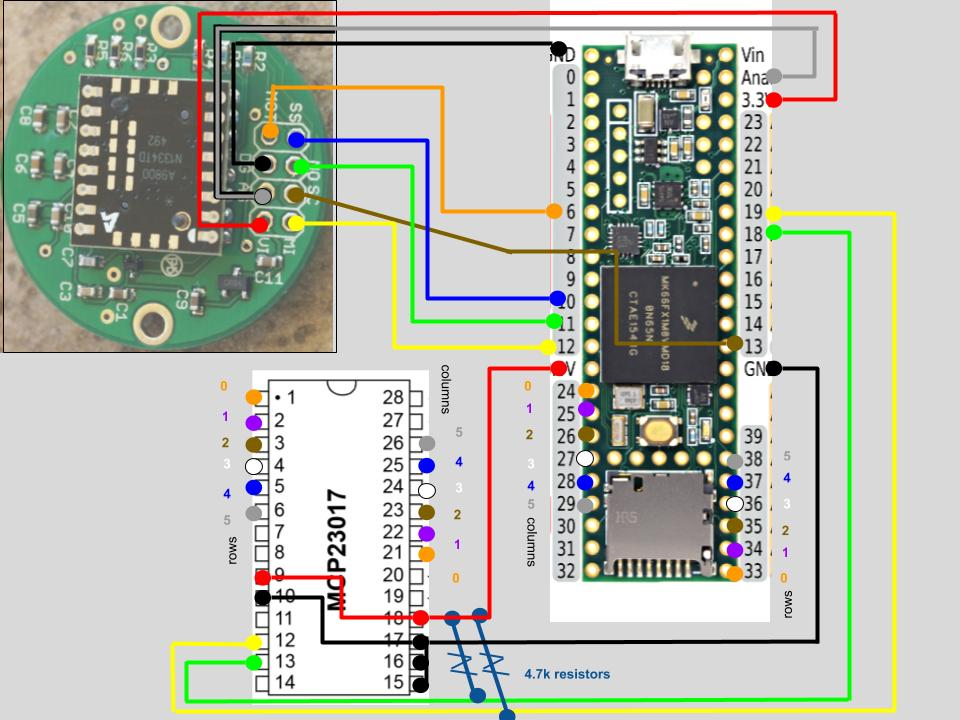

# Simple Firmware for teensy 3.5 / mcp 23017 / adns 9800
## Parts list
1. [teensy 3.5](https://www.pjrc.com/store/teensy35.html)
2. [mcp 23017](https://www.amazon.com/MCP23017-input-output-port-expander/dp/B00I6OEWJM)
3. [adns 9800 laser sensor board](https://www.tindie.com/products/jkicklighter/adns-9800-laser-motion-sensor/)
4. diodes for each key
5. 4.7kΩ resistors * 2
6. A pack of colored solid copper wire
    - I highly recommend using colored wire to follow the colors in the diagram. It's really nice not to have to trace wires around when you're putting it together.

## Some notes about this firmware
- in [keyboard.h](keyboard.h), you can choose which layout you want by swapping out the header files included there.
- it assumes that the diode cathodes (the black rings) are facing the keys
- wiring should look like this:
  
- depending on how you wire this together, you will probably need to touchup `KEY_MAP` [here](4x6.h#L66-L73) or [here](5x6.h#L69-L76)
- when using `5x6.h` the thumb clusters are row 5
- when using `4x6.h` the thumb clusters are row 4 and the d-pad is on row 5

# NOTE
I will probably be *very* slow to respond to any issues around this software, so if you need support and good documentation I would suggest picking some more popular firmware like [qmk](https://github.com/qmk/qmk_firmware)